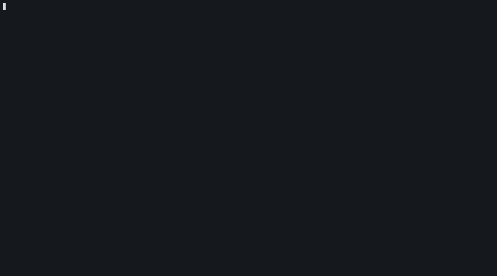

# k8sweep

A terminal UI for cleaning up Kubernetes pods. Browse, filter, and batch-delete dirty pods (Failed, Completed, Evicted, CrashLoopBackOff, OOMKilled) interactively.


## Features

- Interactive TUI with vim-style navigation (`j`/`k`, `gg`, `G`, page switch with `h`/`l` or `←`/`→`)
- Tree view: pods grouped by controller (Deployment, StatefulSet, DaemonSet, Job, CronJob, Standalone) with collapsible groups (`tab`/`T`)
- Real-time pod updates via Kubernetes Watch API (no polling)
- Multi-select pods for batch deletion with scrollable delete preview (namespace, status, age, owner) with Running pod warnings
- Post-delete summary showing successes, failures, and error details
- Force delete stuck pods (`x`) with prominent warning and graceful shutdown bypass
- Controller-aware ownership: pods grouped under their top-level controller with status summary
- Filter pods by controller type (`c` to cycle through controller types)
- Sort columns by name, status, age, restarts, owner, CPU, or memory (`s` to cycle asc/desc)
- Search/filter pods by name in real-time (`/` to search)
- Smart pod-name truncation (middle ellipsis) to keep similar long pod names distinguishable
- Pod detail panel with labels, annotations, containers, and conditions (`i` to inspect a pod)
- Controller drill-down: press `i` on a controller row to focus on its pods only, `esc` to exit
- View recent Kubernetes events for a pod from detail view (`v`)
- View recent container logs (last 100 lines) from detail view (`o`, with container picker for multi-container pods)
- Open interactive pod/container shell from pod detail (`e`, with container picker for multi-container pods)
- Filter toggle to show only dirty pods (turning filter off resets to page 1)
- CPU/memory metrics display (when metrics-server is available)
- Namespace switcher with fuzzy filtering
- Header health summary (`Crit/Warn/OK`) with non-zero counts only
- Standalone pod warnings (pods with no controller)
- Status-colored pod list (red=Failed, cyan=Running, gray=Completed, orange=Evicted) with distinct controller row styling
- Sticky preferences: sort, filter, namespace, collapse, search, and controller drill-down persist across sessions
- Respects `KUBECONFIG` env, `~/.kube/config`, and current context

## Demo



Live terminal demo showing page navigation, smart name truncation, filter toggle, Crit/Warn/OK header summary, and deleting a completed pod.

## Installation

### Quick install (latest release)

```bash
curl -fsSL https://raw.githubusercontent.com/j1shnu/k8sweep/main/scripts/install.sh | bash
```

Optional installer env vars:

- `INSTALL_DIR` (default: `/usr/local/bin`)
- `REPO` (default: `j1shnu/k8sweep`)

### From GitHub Releases

Download the latest binary for your platform from the [Releases](https://github.com/j1shnu/k8sweep/releases) page.

```bash
# Example: Linux amd64
curl -LO https://github.com/j1shnu/k8sweep/releases/latest/download/k8sweep_linux_amd64.tar.gz
tar xzf k8sweep_linux_amd64.tar.gz
sudo mv k8sweep /usr/local/bin/
```

Verify with `k8sweep --version`.

### From source

```bash
git clone https://github.com/j1shnu/k8sweep.git
cd k8sweep
make build
```

Binary will be at `bin/k8sweep`.

### Go install

```bash
go install github.com/jprasad/k8sweep@latest
```

## Usage

```bash
# Use current kubeconfig context
k8sweep

# Specify kubeconfig, context, or namespace
k8sweep --kubeconfig /path/to/config
k8sweep --context my-cluster
k8sweep --namespace kube-system
k8sweep --all-namespaces

# Shorthand flags
k8sweep -k /path/to/config -c my-cluster -n kube-system
k8sweep -A        # all namespaces
k8sweep -v        # print version and exit
```

## Keybindings

### Navigation

| Key | Action |
|-----|--------|
| `j` / `k` / `↑` / `↓` | Navigate up / down (within current page) |
| `l` / `h` / `→` / `←` | Next / previous page |
| `gg` | Go to first pod |
| `G` | Go to last pod |
| `space` | Toggle pod selection (on controller header: select/deselect all in group) |
| `a` | Select / deselect all |
| `tab` | Expand/collapse controller group |
| `T` | Expand/collapse all groups |
| `/` | Search pods by name |

### Actions

| Key | Action |
|-----|--------|
| `enter` | Delete selected pods |
| `x` | Force delete selected pods |
| `r` | Refresh pod list |
| `f` | Toggle dirty pod filter |
| `c` | Cycle controller filter (All → Deployment → StatefulSet → DaemonSet → Job → CronJob → Standalone) |
| `s` | Sort by column (asc/desc) |
| `i` | On pod: view pod details. On controller: drill down (show only its pods) |
| `Esc` | Exit controller drill-down (in browsing mode) |
| `n` | Switch namespace |
| `?` | Toggle help overlay |
| `q` / `Ctrl+C` | Quit |
| `qq` | Quit from any screen (except search/namespace input) |

### Pagination

- Discrete pages: row navigation does not auto-advance to next page.
- Page footer appears only when there are multiple pages:
  `Showing X-Y of N Pods [page P/T] | [l]/[→] next | [h]/[←] previous`

### In search mode

| Key | Action |
|-----|--------|
| Type | Filter pods by name (real-time) |
| `Enter` | Confirm search filter |
| `Esc` | Cancel and clear search |

### In delete preview

| Key | Action |
|-----|--------|
| `j` / `k` / `↑` / `↓` | Scroll pod list |
| `y` | Confirm delete |
| `n` / `Esc` | Cancel |
| `←` / `→` | Toggle Yes/No |

### In delete summary

| Key | Action |
|-----|--------|
| `j` / `k` / `↑` / `↓` | Scroll results |
| `Enter` / `Esc` | Return to pod list |

### In pod detail

| Key | Action |
|-----|--------|
| `j` / `k` | Scroll up / down |
| `gg` | Scroll to top |
| `G` | Scroll to bottom |
| `v` | View pod events |
| `o` | View pod logs (container picker for multi-container pods) |
| `e` | Open shell in pod container |
| `i` / `Esc` | Close detail view (Esc returns to detail from events/logs) |

### In container picker

| Key | Action |
|-----|--------|
| `j` / `k` / `↑` / `↓` | Navigate containers |
| `Enter` | Confirm selection (opens shell or fetches logs) |
| `Esc` | Cancel |

### Controller drill-down

- Press `i` on a controller row (e.g. `Deployment/nginx`) to filter the view to only that controller's pods.
- A `[CONTROLLER]` badge appears below the pod list showing which controller is focused.
- All normal actions work inside drill-down: select, delete, sort, search, pod detail (`i` on a pod row), etc.
- Press `i` on the controller header again or `Esc` to exit drill-down and return to the full pod list.
- Drill-down stacks with other filters (dirty filter, controller type filter, search) — they all apply together.
- Switching namespace automatically clears the drill-down.
- The drill-down selection is saved in preferences and restored on next launch.

### Shell behavior

- Backend order: tries `kubectl exec` first, then falls back to client-go exec streaming.
- Shell fallback order: `/bin/bash` -> `/bin/sh` -> `/busybox/sh`.
- `kubectl` backend uses the same kube target as k8sweep (`--context` and explicit `--kubeconfig` when provided), so shell sessions stay on the same cluster/context as the UI.
- Shell is blocked for terminal pod states (`Completed`, `Failed`, `Evicted`, `Terminating`, `Pending`) and for containers not in Running state.
- Warning prompt for risky pod states (`CrashLoopBackOff`, `OOMKilled`) — press `e` twice to confirm.

### In namespace switcher

| Key | Action |
|-----|--------|
| Type | Filter namespaces |
| `↑` / `↓` | Navigate list |
| `Enter` | Select namespace |
| `Esc` | Cancel |

## What are "dirty" pods?

k8sweep considers these pod statuses as dirty — safe to clean up:

| Status | Detection |
|--------|-----------|
| **Completed** | Pod phase is `Succeeded` |
| **Failed** | Pod phase is `Failed` |
| **Evicted** | Pod status reason is `Evicted` |
| **CrashLoopBackOff** | Container waiting with reason `CrashLoopBackOff` |
| **ImagePullError** | Container waiting with reason `ImagePullBackOff` or `ErrImagePull` |
| **OOMKilled** | Container terminated with reason `OOMKilled` (only if not currently running) |
| **Terminating** (stuck) | Pod has been terminating for longer than 5 minutes past its `DeletionTimestamp` |

## Preferences

k8sweep automatically remembers your UI preferences across sessions. The following are persisted:

| Preference | Trigger |
|------------|---------|
| Sort column & order | Press `s` |
| Dirty pod filter | Press `f` |
| Controller filter | Press `c` |
| Namespace / all-namespaces | Switch namespace via `n` |
| Collapse/expand all groups | Press `T` |
| Search query | Confirm with `Enter` or clear with `Esc` |
| Controller drill-down | Press `i` on controller row or `Esc` to exit |

Preferences are saved to:
- **macOS**: `~/Library/Application Support/k8sweep/preferences.json`
- **Linux**: `~/.config/k8sweep/preferences.json` (or `$XDG_CONFIG_HOME/k8sweep/`)

CLI flags (`-n`, `-A`) always override saved preferences. If the saved namespace no longer exists, k8sweep falls back gracefully. Missing or corrupt preferences files are silently ignored.

## Development

```bash
make build      # Build binary
make run        # Run directly
make test       # Run tests with race detector
make coverage   # Show test coverage
make lint       # Run golangci-lint
make clean      # Clean build artifacts
```

## Architecture

```
internal/
  app/          # Bubble Tea state machine (Browsing → DeletePreview → DeleteSummary → Searching → Help → Detail)
  k8s/          # Kubernetes client, Watch API, pod operations, metrics, detail, events, logs
  tui/          # UI components (podlist, header, footer, deletepreview, deletesummary, namespace, poddetail, help, styles)
  resource/     # Resource interface for extensibility (Jobs, PVCs planned)
```

## License

MIT
